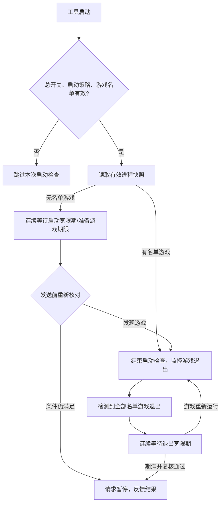
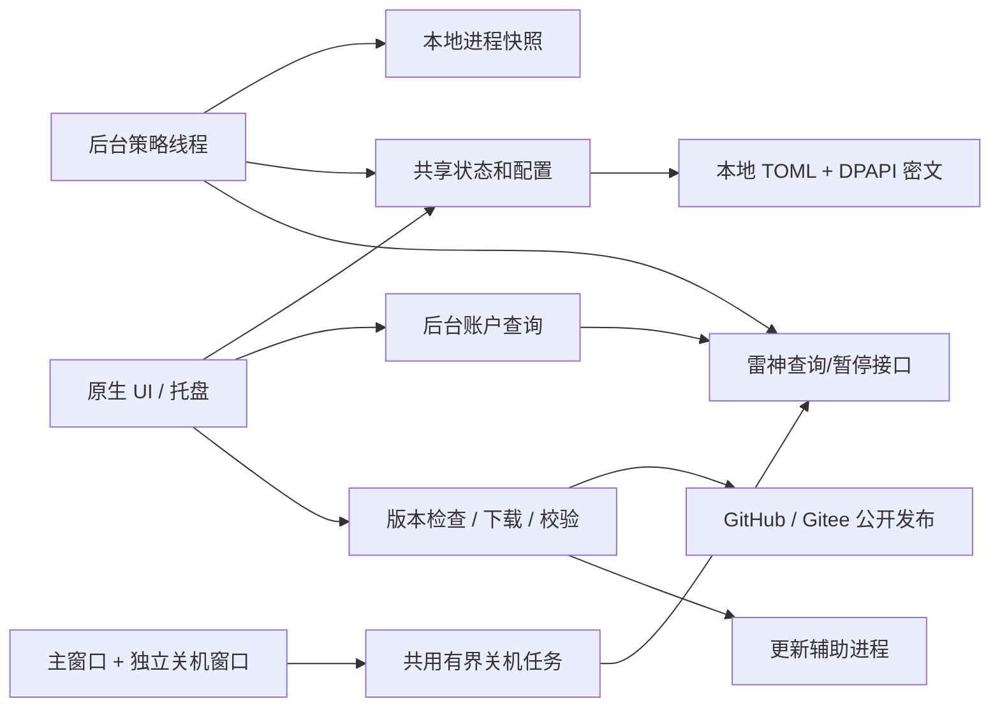
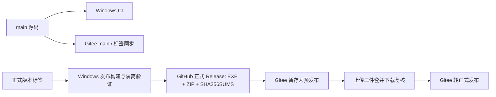
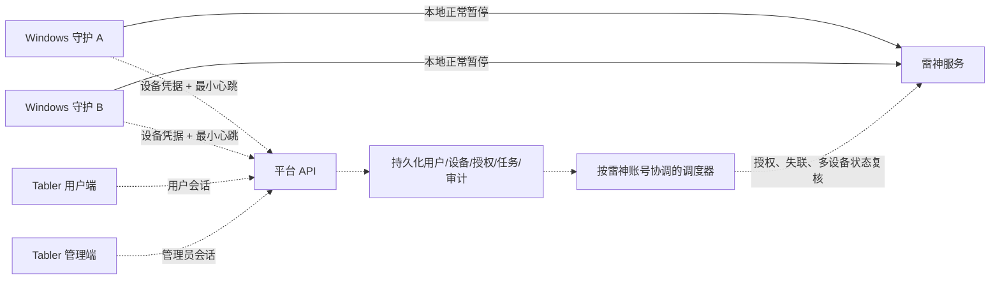

# 雷神守护：项目现状、实现说明与发展规划

> 文档日期：2026-09-20；线上核验于北京时间当日凌晨完成，官网首次检查记录时间为 00:21，随后补查三个下载来源。本文是本次核验的交接快照，不是实时监控页面。
>
> 正式软件版本：**v0.12.3**；程序基线：`b9160d6`；本次整理前的 GitHub 主分支：`5bc4ef1`（新增 Tabler 设计资料）。
>
> 当前阶段：**Windows 本地守护已发布；官网已上线；多用户远程守护完成方案与三页效果稿，尚未开发和部署。**

## 阅读导航

- [1. 项目定位与当前结论](#1-项目定位与当前结论)
- [2. 项目入口与交付物](#2-项目入口与交付物)
- [3. 功能实现清单](#3-功能实现清单)
- [4. 本地暂停规则与边界](#4-本地暂停规则与边界)
- [5. 本地技术架构](#5-本地技术架构)
- [6. 安装、发布与更新体系](#6-安装发布与更新体系)
- [7. 官网、SEO 与 AI 可发现性](#7-官网seo-与-ai-可发现性)
- [8. 验证证据与当前待办](#8-验证证据与当前待办)
- [9. 远程守护的目标与总体方案](#9-远程守护的目标与总体方案)
- [10. 多用户账号与数据模型](#10-多用户账号与数据模型)
- [11. Tabler 用户侧与管理侧](#11-tabler-用户侧与管理侧)
- [12. 服务器与下载节点方案](#12-服务器与下载节点方案)
- [13. 分阶段实施与验收](#13-分阶段实施与验收)
- [14. 未来可拓展方向](#14-未来可拓展方向)
- [15. 维护、交接与资料索引](#15-维护交接与资料索引)

## 1. 项目定位与当前结论

雷神守护（Leigod Guard）是配合雷神加速器使用的独立 Windows 开源工具。它读取用户配置的游戏进程状态，在适当的等待和复查后请求暂停雷神账户计时，减少忘记暂停造成的闲置消耗。项目采用 MIT 许可证，与雷神加速器运营方没有官方隶属或合作关系。

目前能交付的是 Windows 10 / 11 x64 客户端、安装包与绿色包、应用内更新、官网介绍和下载入口。**暂停计时与停止客户端加速是两个不同动作；当前程序只处理前者。** 选择游戏、线路、开启加速仍在雷神官方客户端完成；本工具不自动开启加速、不自动恢复计时、不退还已消耗时长。

下表是最需要保留的现状判断：

| 事项 | 当前结论 | 不能据此推断的内容 |
| --- | --- | --- |
| Windows 正式版 | GitHub 与 Gitee 均有 v0.12.3 正式发布及三件套 | 不代表用户电脑已安装这个版本 |
| 本地正常关机修复 | 代码已进入 v0.12.3，隔离窗口回归通过 | 尚无该修复在用户电脑真实关机、真实账户上的验收证据 |
| 突然断电/强制关机 | 本地程序无法在失去执行机会后继续暂停 | 重启检查不能追回关机期间已经消耗的时长 |
| 官网静态内容 | 本次首页和五个 SEO/AI 资料地址均返回 200 | HTTP 200 不等于搜索引擎已收录或 AI 已引用 |
| 官网最新下载解析 | 已实现并有测试；本次线上三个来源模式均返回 503 | 不能描述为目前可稳定自动解析最新包 |
| Gitee 同步 | v0.12.3 资产同步成功；随后设计稿的源码同步失败 | 发版附件同步与 main 分支同步不能互相替代验收 |
| 远程平台 | 用户确认采用 Tabler，三页静态效果稿已入库 | 目前没有真实网站账号、设备心跳、后台任务或远程暂停 |
| 香港服务器 | 只有用户提供的规格，未登录检查或部署 | 不能承诺容纳多少用户、国内下载速度或线上稳定性 |

本文使用四种状态：**已实现**表示存在代码；**已发布/上线**表示有对应交付；**已验证**必须注明环境和范围；**规划中**不代表用户已经可以使用。没有用一个总体完成百分比掩盖这些差异。

## 2. 项目入口与交付物

| 入口 | 地址/位置 | 用途 |
| --- | --- | --- |
| GitHub 主仓库 | [CMMUU/leigod-guard](https://github.com/CMMUU/leigod-guard) | 主代码源、Issues、Actions、正式发布 |
| Gitee 镜像 | [cmmuu/leigod-guard](https://gitee.com/cmmuu/leigod-guard) | 国内源码与发布包入口 |
| 官方项目介绍页 | [leigod.cmmuu.com](https://leigod.cmmuu.com/) | 介绍、规则、下载、FAQ、公开资料 |
| GitHub v0.12.3 | [正式发布页](https://github.com/CMMUU/leigod-guard/releases/tag/v0.12.3) | EXE、ZIP、SHA256SUMS |
| Gitee 发布 | [发布列表](https://gitee.com/cmmuu/leigod-guard/releases) | 已核验包含 v0.12.3 正式版 |
| 桌面使用说明 | [README](../README.md) | 安装、登录、配置游戏与结果核验 |
| 远程业务方案 | [REMOTE_GUARD_PLAN.md](REMOTE_GUARD_PLAN.md) | 多用户、多设备与失联兜底的边界 |
| 远程视觉稿 | [三页设计说明](remote-guard-design/README.md) | 登录、我的守护、管理员监控总览 |

### 2.1 当前正式资产

GitHub 发布于北京时间 **2026-09-19 20:42:54**，不是草稿或预发布。Gitee release ID 为 `1153852`，本次公开 API 核验其 `prerelease=false`，列有同名 EXE、ZIP 和校验文件；按最近 100 条公开正式版的语义版本比较，最高为 v0.12.3。

| 文件 | GitHub 资产大小 | 用途 |
| --- | ---: | --- |
| `leigod-guard-v0.12.3-windows-x64-setup.exe` | 7,926,718 字节 | 当前用户安装版 |
| `leigod-guard-v0.12.3-windows-x64.zip` | 5,539,925 字节 | 解压使用的绿色版 |
| `SHA256SUMS.txt` | 212 字节 | 完整性校验清单 |

GitHub 资产元数据中的 SHA-256：

```text
setup.exe  d49678c03b498d56ccf1a46f62d3085b711a3c70e773e88fd901889b7ff76ab3
portable   4b98f409a790d4b98b96e20aa076e49ab440a7944fcabcda0d65cd33db13e526
checksums  af09144efed4bee9e62075675ce788eadeeaebdfd5842723e38f9d1eb534ca2c
```

本次整理读取发布元数据及成功同步日志，没有再次下载所有二进制做逐字节校验；Gitee 同步程序自身要求下载复核一致后才转为正式发布。上表也不包含平台自动生成的源码归档，源码 ZIP 不能当绿色可执行包使用。

### 2.2 版本演进摘要

| 阶段 | 已落地变化 |
| --- | --- |
| 0.5.x | 首次开源发布；增加安装版 |
| 0.6.x | 应用内检查、下载和应用更新 |
| 0.7–0.8.x | 启动无游戏检查、准备游戏保护、游戏预设、Gitee 来源、同步流程和注入兼容处理 |
| 0.9.0 | Apple 风格浅色侧栏与卡片界面 |
| 0.10.x | 国内优先自动选源；修复账户查询长时间停留在查询中 |
| 0.11.x | 剩余时长、启动/打开面板自动刷新、时分秒显示、退出倒计时每秒显示和静默启动初版 |
| 0.12.0–0.12.1 | 按 Serylane 参考调整原生 UI，隐藏滚动条并保留滚动及键盘导航 |
| 0.12.2 | 修复带静默参数仍出现主页的首次窗口显示问题 |
| 0.12.3 | 主窗口和独立窗口协调正常关机暂停；补充远程业务方案 |
| 发布之后的文档提交 | 选定 Tabler，提交三页远程平台效果稿；没有新增软件版本 |

精确变化和限制以 [CHANGELOG](../CHANGELOG.md) 为准。桌面当前风格是 0.12.x 原生 UI；**Tabler 选型作用于拟开发的 Web 用户侧与管理侧，并未替换桌面渲染框架。**

## 3. 功能实现清单

| 模块 | 实现与当前行为 | 状态/限制 | 主要依据 |
| --- | --- | --- | --- |
| 游戏识别 | 读取 Windows 进程快照，完整文件名、不区分大小写匹配 | 已发布；不注入游戏、不读写游戏内存；未逐款验证所有反作弊组合 | `src/monitor.rs` |
| 游戏名单 | 8 个热门预设、自定义名称/进程、从运行进程选择、移除 | 已发布；区服与启动器可能改变进程名 | `src/game_presets.rs`、`src/ui_home.rs` |
| 游戏退出暂停 | 先观察到游戏，再等全部退出及宽限期结束，复核后请求暂停 | 已发布；默认 90 秒 | `src/worker.rs` |
| 启动补查 | 本次启动名单有效且策略开启，无游戏连续等待后暂停 | 已发布；默认 180 秒，一次启动只做一轮 | `src/worker.rs` |
| 准备游戏 | 尚未结束的启动检查可延后至少 10 分钟 | 已发布；不会启动/恢复加速，不影响退出宽限期 | `src/worker.rs` |
| 手动暂停 | 账户页、首页或托盘发起暂停请求 | 已发布；接口返回与最终账户状态须区分 | `src/ui.rs`、`src/worker.rs` |
| 正常关机暂停 | 两个窗口共用有截止时间的一次任务 | v0.12.3 已发布，真实关机结果待核验 | `src/shutdown.rs`、`src/session_end.rs` |
| 静默自启 | 当前 Windows 用户登录后仅托盘驻留 | v0.12.2 修复已发布；默认不开启自启 | `src/autostart.rs`、`src/window_visibility.rs` |
| 托盘行为 | 打开面板、暂停、延后、退出；退出不二次确认 | 已发布；关闭主窗口是隐藏，不等于退出 | `src/ui.rs` |
| 单实例 | 再次运行快捷方式唤起已运行实例 | 已发布；不是多设备协调机制 | `src/instance.rs` |
| 登录 | 密码、短信验证码、手动 token；按需人机验证 | 已发布；依赖雷神与验证码服务可用 | `src/leigod_api.rs`、`src/captcha.rs` |
| 本地凭据 | token 和可选密码 MD5 用当前 Windows 用户 DPAPI 加密 | 已发布；账户名仍是明文，不是跨机凭据托管 | `src/dpapi.rs`、`src/config.rs` |
| 账户查询 | 后台执行、合并重复请求、超时恢复、丢弃旧账户结果 | 已发布；HTTP 请求上限 12 秒，界面等待上限 15 秒 | `src/ui.rs`、`src/shared.rs` |
| 剩余时长 | 最近一次服务端余额，完整显示时/分/秒与查询时间 | 已发布；本地不模拟逐秒扣费 | `src/leigod_api.rs`、`src/ui_home.rs` |
| 界面滚动 | 隐藏轨道、滚轮/触控板、渐隐边缘、键盘翻页 | 已发布；日志可停留历史，回到底部再跟随 | `src/ui_scroll.rs` |
| 应用图标 | 盾牌、暂停与时钟品牌，EXE/安装器/窗口/托盘一致 | 已发布；图标资源检查进入 CI | `assets/`、`build.rs` |
| 游戏加加保护 | 可选严格 DLL 加载限制，保护本工具进程 | 已发布、默认关闭；需完全退出重开，也可能影响其他第三方 DLL | `src/osd.rs` |
| 更新 | 两来源、完整性校验、安装/绿色方式保持、更新后重开 | 已发布；用户点击后才下载安装 | `src/updater.rs`、`src/update_apply.rs` |
| 日志 | 界面日志与轮转诊断日志 | 已发布；无在线集中日志/远程运维 | `src/ui.rs`、`src/shared.rs` |
| 官网 | 静态单页面加版本解析函数 | 已上线；当前解析接口出现 503，见第 8 节 | `website/` |
| 远程账号与后台 | 多用户、设备配对、心跳、调度、管理图表 | 规划及效果稿；全部业务能力尚未实现 | `docs/REMOTE_GUARD_PLAN.md` |

预设包括 PUBG、CS2、Apex、英雄联盟对局、无畏契约国际服、堡垒之夜、火箭联盟、守望先锋。预设减少录入，不等于发行方认证或实际兼容性保证。

## 4. 本地暂停规则与边界

### 4.1 当前默认参数

| 配置/行为 | 默认值 | 说明 |
| --- | --- | --- |
| `strategy.enabled` | `true` | 启动检查和正常游戏退出自动暂停总开关 |
| `strategy.check_interval_secs` | `3` | 后台进程检测间隔；与每秒刷新倒计时不同 |
| `strategy.grace_secs` | `90` | 全部名单游戏退出后的连续等待 |
| `strategy.pause_on_startup` | `true` | 是否启用本次启动补查 |
| `strategy.startup_grace_secs` | `180` | 首次成功发现无游戏起连续等待 |
| 准备游戏延后 | `600` 秒 | 按最近一次点击计算，不累加十分钟 |
| 自动暂停失败冷却 | `60` 秒 | 一轮失败后冷却，再核对条件 |
| `strategy.pause_on_shutdown` | `true` | 独立于自动暂停总开关 |
| `strategy.autostart` | `false` | 用户开启后才注册静默自启 |
| `strategy.block_gamepp_injection` | `false` | 完全退出再打开后应用/撤销 |
| `updates.check_on_startup` | `false` | 即便开启也只检查，不自动下载安装 |
| `updates.source` | `auto` | 旧配置明确选择单源的仍保留 |

首次配置游戏名单为空，所以默认开关为 true 并不意味着第一次打开就会暂停。`plans`、游戏 `plan`、`min_run_secs` 是保留字段，不能把它们描述成当前已工作的自动加速或最短游戏时长功能。详见 [配置示例](../config.example.toml)。

### 4.2 启动与游戏退出两条路径



关键边界：

1. 180 秒与 90 秒分别属于启动检查和游戏退出，不相加。倒计时 UI 每秒显示，不代表每秒查询账户或扫描进程。
2. 只有检测到过名单游戏，正常退出监控才有“退出”的依据；未加入名单的游戏不会被识别。
3. 空名单、任一无效进程名或相应开关关闭，会跳过本次启动检查；稍后修好配置不会自动补做已结束的启动检查。重新打开工具可开始新一轮。
4. “准备游戏”只延后尚未结束的启动检查；已经完成/跳过之后再点，不会重开检查。工具不能识别用户在雷神客户端点击开启加速。
5. 进程枚举失败不能视为没有游戏；连续无游戏等待会重新建立，显式准备保护期限保留。
6. 登录或重试期间游戏可能启动，所以实际发送前还会复查名单、开关、游戏状态与延后请求。
7. 下载或其他工作需要持续加速时，可关闭相应策略；关闭总开关不会自动关闭独立的关机暂停。

### 4.3 正常关机漏处理的修复

此前实现主要依赖独立隐藏窗口接收结束会话消息。v0.12.3 在实际主窗口创建时安装永久处理器，与独立窗口共用协调器；静默窗口后来打开后也保留监听。

- `WM_QUERYENDSESSION` 允许系统结束会话，不在询问阶段发送暂停；取消关机不应误暂停。
- 确认的 `WM_ENDSESSION` 才发起一次暂停任务；重复通知和多个窗口共用同一截止时间与结果。
- 所有窗口总等待预算最多 **4 秒**；本次网络请求最多 **3 秒**、连接最多 **1 秒**，实际还受剩余预算约束。
- 读取策略和 token 的锁等待有界，避免界面线程与关机回调相互等待；没有登录态时记录未确认。
- 关机期间不做交互登录、人机验证或额外账户查询；请求返回成功也提示到官方小程序核对。
- 调整应用处理顺序，未修改系统注册表的关机超时，也不需要管理员权限。

**覆盖范围是正常系统结束会话时的尽力处理。** 突然断电、长按电源强制关机、进程被强制终止、网络先断开、凭据过期或系统不给足执行时间仍可能失败。不存在仅靠本地 UI 修复就能覆盖所有异常关机的方案。

### 4.4 账户查询与结果确认

恢复保存的登录态时自动查询；打开面板、托盘唤起或进入账户页也刷新，快速重复操作最短间隔 5 秒。首页/账户页处于前台时每 60 秒查询；隐藏、失焦或切换到其他页面不继续该定时查询。手动刷新、登录及暂停后的结果也会更新余额。

余额显示的是最近一次查询值，不是实时扣费推算。查询失败、未登录、未知响应、无法识别余额都不能显示为“确定剩余 0”。界面成功反馈也不能替代实际账户核验。

真实验证步骤：完成工具操作后，在**雷神官方微信小程序登录同一账号并下拉刷新**，查看计时状态；核对之前不要先手动点暂停，否则无法判断本工具是否生效。若仍计时，应先用官方入口暂停，再排查登录、网络、名单与日志。

### 4.5 静默启动的准确含义

当前是当前用户的 Windows 登录自启动，**不是 Windows 服务，也不是登录前即运行**。自启用 `--minimized`，只驻留托盘；手动首次运行正常显示，托盘或再次运行快捷方式可打开面板。

v0.12.2 同时处理首次绘制写入可见属性的问题。托盘暂不可用时每 5 秒后台重试；静默启动致命初始化失败记日志并退出，非致命提醒等主动打开再显示。因此“没有弹出主页”本身不能证明守护一定正常运行，仍可通过托盘、日志和进程状态核验。

## 5. 本地技术架构

### 5.1 技术栈与职责

当前使用 Rust 2021，`eframe/egui 0.31` 构建原生 UI，`wgpu` DirectX 12 渲染，`tray-icon` 提供托盘。Windows Toolhelp 负责进程快照；Windows API 负责窗口、自启关联、DPAPI 和进程保护。HTTP 使用 `reqwest` 与 `rustls`，配置使用 TOML，序列化使用 Serde。

验证码窗口使用 `wry/tao` 和 WebView2，由单独子进程承载。安装打包使用 PowerShell 与 Inno Setup。正式目标为 `x86_64-pc-windows-msvc`，静态链接 C/C++ 运行库。依赖版本以 [Cargo.toml](../Cargo.toml) 与锁文件为准。



该图是当前实现，不包含远程守护服务器。后台线程和窗口协作不等同于具有常驻、独立于用户会话的 Windows 服务。

### 5.2 源码导航

| 文件/目录 | 职责 |
| --- | --- |
| `src/main.rs` | 启动、命令行分支、辅助进程入口及各模块装配 |
| `src/config.rs` | 配置结构、默认值、兼容、进程名验证与读写 |
| `src/shared.rs` | UI 与后台状态交换、查询/日志状态 |
| `src/worker.rs` | 本地守护状态机、连续等待、延后、重试前复查 |
| `src/monitor.rs` | Windows 进程快照与名单匹配 |
| `src/leigod_api.rs` | 登录、查询、暂停及余额解析；有底层恢复接口定义不代表产品已开放恢复能力 |
| `src/shutdown.rs`、`src/session_end.rs` | 系统消息接入、任务协调、限时暂停与诊断 |
| `src/autostart.rs`、`src/instance.rs`、`src/window_visibility.rs` | 当前用户自启、单实例、静默窗口 |
| `src/ui*.rs` | 页面、主题、标题栏、滚动和离屏渲染测试 |
| `src/osd.rs` | 本工具进程的可选注入保护与兼容处理 |
| `src/updater.rs`、`src/update_sources.rs`、`src/update_apply.rs` | 选源、验证、下载、安装/绿色替换与恢复 |
| `scripts/`、`installer/` | 构建、打包、同步和隔离验证 |
| `.github/workflows/` | CI、正式发布、Gitee 同步、网站发现 |
| `website/` | 现有官网与公开下载解析函数 |
| `docs/remote-guard-design/` | Tabler 图片、设计约定和提示词；不是可运行的 Web 项目 |

### 5.3 数据位置与敏感性

| 内容 | 位置/策略 |
| --- | --- |
| 安装版程序 | 默认 `%LOCALAPPDATA%\Programs\LeigodGuard\` |
| 共享用户配置 | `%APPDATA%\leigod-guard\config.toml` |
| 诊断日志 | 同目录 `debug.log`、`debug.log.1`；约 1 MiB 时尝试轮转 |
| 验证结果临时文件 | 同目录 `captcha-result.txt/.tmp`；正常流程尝试删除，异常可能残留 |
| 更新暂存 | `%LOCALAPPDATA%\LeigodGuard\updates\update-*\` |
| 绿色更新备份 | 原程序目录 `.leigod-update-*\`，当前不按时间自动清理 |

同一 Windows 用户的安装版与绿色版共用配置。升级及卸载保留账户数据和游戏名单；绿色版不等于无磁盘痕迹或全部数据随程序移动。自启写入当前用户 Run 注册表项，未开启则不会由安装器新增。

token 与可选密码 MD5 经过 DPAPI 加密；MD5 仍是敏感登录凭据，不能作为匿名数据公开。DPAPI 不防御已经以同一用户身份执行的恶意代码，也不能直接作为未来服务器可解密的凭据。日志、验证码结果、截图和个人配置不得作为公开示例提交。更完整的数据生命周期见 [隐私说明](PRIVACY.md)。

## 6. 安装、发布与更新体系

### 6.1 安装与绿色版

安装版面向一般用户，创建快捷方式、卸载入口，并迁移已经存在的本工具自启路径；默认当前用户安装，不要求管理员权限。绿色版完整解压后使用，不创建安装器卸载记录。

两者都需要验证码功能所依赖的 WebView2 Runtime。安装器携带微软联网安装引导程序，缺失运行时时才补装；**不是全离线 WebView2 安装包**。卸载本工具不删除共享 WebView2 Runtime。

当前程序与安装器**尚无 Windows 代码签名**。发布中的 SHA-256 解决文件完整性核对，不能替代发行者身份签名；后续签名属于独立工作项。

### 6.2 国内优先规则已经固定

1. 自动模式并行限时查询 GitHub 与 Gitee，先比较完整、正式、可用的新版本，再在同版中优先国内源。
2. 保留严格“仅 Gitee”“仅 GitHub”；明确单源时检查、清单和包文件均不跨源。
3. 来源失败是检查不完整，不能说已是最新版。旧配置的明确来源选择保留。
4. 只在用户点击后下载和安装；启动检查更新默认关闭，启用后也不自动安装。
5. 固定目标版本、安装方式、精确文件名、大小和已确认 SHA-256；备用源必须提供同一文件。
6. 备用下载重新开始，不拼接不同来源残片，不降级、不换装。一次自动更新最多主源和备用源各尝试一次。
7. 安装版用 EXE，绿色版用 ZIP；保存配置后退出旧程序，辅助进程替换并重新打开。更新期间监控短暂停止，重启后正常执行启动策略。

检查阶段共享 8 秒期限；下载与读取有停滞超时，持续缓慢传输另有总时限。详细参数和不支持的目录类型见 [更新规则](UPDATES.md) 与 [发版说明](RELEASING.md)。这些约束也是以后新增香港下载节点时必须保留的基线。

### 6.3 GitHub 到 Gitee 的流水线



Git 仓库同步只同步代码和标签，不会自动带上 Release 附件。因此专门的 `sync_gitee.py` 负责创建发布、同步说明和附件。Gitee 复用 GitHub 的同一份构建，不应在同版本号下重编译另一份包。

同步配置使用 Actions Secret `GITEE_TOKEN`。v0.12.3 发布同步已经成功，不能继续把状态写成“尚缺凭据所以停留在 v0.8.0”。后来的源码同步失败日志是 Git push 失败或超时；根因仍待核查，不能直接归因为 token 缺失。

## 7. 官网、SEO 与 AI 可发现性

### 7.1 现有部署结构

官网在 Cloudflare Pages，项目名 `leigod-guard`，生产分支 `main`，根目录 `website`，构建 `node build.mjs`，输出 `dist`。正文使用静态 HTML/CSS，字体和图像不要求外部前端 CDN；构建从 Cargo 和 Git 派生版本与内容修改信息。

“静态官网”与“动态解析最新版”不冲突：介绍正文保持静态，`/api/downloads` 由 Pages Functions 查询公开版本，`/download/installer` 与 `/download/portable` 把浏览器跳转到平台文件地址。成功的来源结果在边缘最多缓存 5 分钟。

因此最新下载信息可能存在缓存窗口，并非强实时。网页不代理大安装包；一旦浏览器开始传输，页面不能可靠判断每次下载失败，也不负责自动覆盖安装。**应用内更新**与**官网浏览器下载**是两条不同流程。

### 7.2 已实现的发现基础

| 能力 | 当前内容 |
| --- | --- |
| 正文与关键词 | 项目真实用途、暂停规则、Windows 范围、常见游戏场景与 FAQ |
| 标题和分享 | 中文标题、摘要、分享卡片、品牌图与应用截图 |
| 唯一地址 | 正式域名 canonical；默认 Pages 域名按主机设置 noindex |
| 结构化数据 | WebSite、WebPage、SoftwareApplication、FAQPage；无编造评分与下载量 |
| 抓取入口 | `robots.txt`、`sitemap.xml`、真实 404 |
| AI 可读资料 | `index.html.md`、`llms.txt`、`llms-full.txt` |
| 内容一致性 | FAQ 可见正文、结构化数据和 Markdown 共用来源；版本来自 Cargo |
| 更新通知 | Website discovery 工作流验证线上内容后提交 IndexNow |

本次读取首页、robots、sitemap、两份 llms 和 Markdown 概览均为 HTTP 200，首页包含 0.12.3。这里只证明公开地址可读取，不代表本次重新审计了全部响应头、爬虫权限或搜索排名。

`llms.txt` 是资料入口，不能承诺 AI 强制收录。IndexNow 是更新通知，接收成功也不等于已收录；其 HTTP 返回语义见 [IndexNow 官方文档](https://www.indexnow.org/documentation)。Google、百度和 Bing 的索引情况仍应按对应站长平台报告与真实结果核验。本次没有重新登录这些控制台，也没有取得新的排名或 AI 引用数据。

后续应优先补真实使用指南、故障排查、公开版本与站长报告，而不是重复堆砌游戏名。社区介绍可以帮助发现项目，但尚未在本次工作中对外发帖。现有站点没有访客统计脚本或平台账号登录，也没有收集客户端账户和进程列表。详见 [SEO 专项说明](SEO.md)。

## 8. 验证证据与当前待办

### 8.1 本次核验的证据

| 证据 | 结果 | 范围 |
| --- | --- | --- |
| [GitHub v0.12.3 发布](https://github.com/CMMUU/leigod-guard/releases/tag/v0.12.3) | 正式版及三件套存在 | 发布元数据，不是用户安装确认 |
| [发布工作流 35443052884](https://github.com/CMMUU/leigod-guard/actions/runs/35443052884) | success | 构建、打包与发布 |
| [CI 35445834712](https://github.com/CMMUU/leigod-guard/actions/runs/35445834712) | success，提交 `5bc4ef1` | Windows 隔离 runner |
| 该 CI 的 Rust 单元测试 | 113 passed、0 failed、4 ignored | 另有一个渲染测试在专门步骤执行通过；不等于所有 ignored 均执行 |
| Gitee 同步器离线测试 | 22 项通过 | 模拟同步状态与错误，不代表网络永不失败 |
| 实际 eframe 静默测试 | 静默/手动两种启动路径通过 | 独立测试窗口，未操作用户运行中的程序 |
| 实际 eframe 结束会话测试 | 静默未打开、手动、静默后打开三种场景通过 | 确认、取消、重复通知；不发真实系统关机 |
| 安装/升级/卸载与更新辅助进程 | CI 隔离验证通过 | 更新测试使用无账户的替身程序；日志中的 0.12.4 是测试目标，不是已发版版本 |
| [Gitee 发布同步 35443655825](https://github.com/CMMUU/leigod-guard/actions/runs/35443655825) | success，日志报告 v0.12.3 三个附件同步完成 | 结束时间北京时间 2026-09-19 21:08 左右 |
| Gitee 公开 API | v0.12.3 正式版、EXE/ZIP/SHA256SUMS 存在 | 本次只读核验 |
| [Gitee 源码同步 35445834703](https://github.com/CMMUU/leigod-guard/actions/runs/35445834703) | failure，Git push 失败或超时 | 当次目标是 `5bc4ef1`；本次查询 main 仍为 `b9160d6` |
| 官网公开资料 | 六个路径 HTTP 200 | 见第 7 节 |
| 官网 `/api/downloads` | 默认及显式 auto/gitee/github 返回 HTTP 503 | 多种模式的本次短时观测，不是长期可用率统计 |

本次是文档审计，读取了已有 CI 结果，未重新运行整套 Windows 构建，也未关机、重新登录、暂停真实账户、升级或重启用户的应用。

### 8.2 按优先级整理的问题

| 优先级 | 问题/缺口 | 当前证据 | 建议后续处理与完成标准 |
| --- | --- | --- | --- |
| P0 | 官网最新下载解析 503 | 三种来源均返回“暂未查到可用的完整正式版”；两平台发布资产本身存在 | 查 Pages Functions 日志、实际部署版本、上游响应/重定向/校验及超时；恢复元数据与两个下载跳转，再验证不同来源和失效场景 |
| P1 | 最新文档未同步到 Gitee main | GitHub `5bc4ef1`，Gitee `b9160d6`，refs 同步失败 | 排查 Git push 超时/可达性和权限，正常重跑后比对提交与标签；不强推覆盖未知变更 |
| P1 | v0.12.3 真实关机验收缺失 | 现有证据仅隔离消息与回调 | 在用户可中断工作时验证正常关机/注销、静默状态、取消关机，并用官方小程序确认；不要在游戏中触发 |
| P1 | 突然断电缺少在线兜底 | 当前只有本地程序 | 实施可选远程方案，覆盖多设备与失联误判后灰度启用 |
| P1 | 服务器出口与雷神授权可行性未知 | 未在 HK 节点测试 | 用专门测试账号核实查询/暂停、token 生命周期、异地/IP 与验证要求，再决定托管方式 |
| P2 | 未签名发布 | 构建/发布说明明确 | 规划签名与发布者验证，保留现有 SHA-256 检查 |
| P2 | 更新缓存和备份无自动清理 | 当前隐私/更新实现 | 增加保留策略与可恢复清理，不能删除进行中的事务 |
| P2 | 搜索收录成效缺乏数据 | 没有本次站长平台报告 | 定期看实际索引、抓取与查询词；区分官网子站与主域统计 |
| P2 | 非 Windows 支持缺失 | 代码显式限制 Windows | 先抽象 OS 能力再评估其他平台；Web 移动可用不等于原生多平台 |

官网 503 的根因尚未定位。本次没有修改解析规则或放宽哈希/地址检查来掩盖问题；可临时从上面的 GitHub/Gitee 发布页获取文件。以上状态应在修复后更新日期与证据，不能长期作为“当前故障”保留。

## 9. 远程守护的目标与总体方案

本节及后续方案是待开发设计。业务对象已明确为：**多位用户、每位用户的多台电脑上的雷神守护**。尚未要求实现通用远程桌面，也不是任意命令执行平台。

### 9.1 为什么采用本地主处理、服务器兜底

| 方式 | 优点 | 局限 | 结论 |
| --- | --- | --- | --- |
| 全部本地处理 | 进程状态直接、响应快、凭据留本机 | 断电或进程终止后无法执行 | 保留为基础能力 |
| 全部交给服务器 | 可持续在线，便于统计 | 依赖心跳及服务器网络，离线不能确定是否仍在游戏，增加凭据托管 | 不作为默认唯一执行端 |
| 本地 + 可选远程兜底 | 日常本机暂停，失联后远端延迟复查并处理 | 需要账号聚合、去重、撤销和故障保守策略 | 已确定的总体方向 |

本地继续负责游戏退出、启动补查、正常关机等及时处理；服务器提供账号级协调和失联后的有限补救。远程功能默认关闭，用户主动注册、配对设备并授权后才启用。本地使用不应被迫注册平台账号。

### 9.2 拟议架构



实线表示已存在的本地调用能力；虚线表示尚未落地的远程部分。现有官网继续做介绍和下载，平台 Web/API 另行部署；具体子域名待确定，未创建相应 DNS 或服务。

### 9.3 心跳与失联判定

拟议默认值：心跳 **15 秒**，最近 **45 秒**收到有效心跳算在线，失联达到 **120 秒**才进入暂停判断，界面查询 **10–15 秒**。这些是首版候选参数，尚未经过压测与故障实验，不能当作当前客户端配置。

心跳最小字段可包括：设备 ID、会话代次、序号、客户端版本、游戏是否运行、准备游戏保护期限、策略版本。服务器以自己的接收时间判断超时，客户端时间仅作辅助。进程检测失败单独表达为未知，不上传完整进程列表。

拟议处理流程：

1. 用户启用远程功能并将设备绑定到自己有权管理的雷神账号。
2. 在线时本地独立工作；正常关机本机先尝试暂停，再尽力通知远端，不依赖关机通知一定送达。
3. 服务器发现失联，等待阈值到期，不立即暂停。
4. 按雷神账号聚合所有绑定设备；任一有效游戏/准备保护仍在使用，不因另一台离线而暂停。未知状态走待核实或保守处理，不默认安全。
5. 验证授权、策略、最新会话代次及待处理任务；按账号串行执行，发送前再次复核。
6. 发出请求后查询计时状态，记录已确认、失败或未确认；有限重试与退避，授权失效停止重试。
7. 设备恢复、用户延后、关闭策略或撤销授权时，取消尚未发出的旧任务；服务重启恢复任务时重新判断，不能直接执行全部积压。
8. 网络大范围故障或大量设备同时失联时触发保护，暂停自动批量决策，先告警和核实服务健康。

心跳只能证明“最近有通信”，不能彻底区分断电与网络分区，也无法知道未接入本平台的其他电脑是否在使用同一雷神账号。已经发出的暂停请求可能与设备恢复并发；应记录并提示，不自动恢复计时。不能承诺零误暂停、零时长损失。

### 9.4 任务状态与结果口径

拟议任务状态为 `待复查 → 待执行 → 执行中 → 已确认 / 失败 / 未确认 / 已取消`。重试属于同一逻辑任务的尝试记录，不重复增加暂停次数。

- 请求提交成功：平台接受操作，尚未证明雷神计时改变。
- 接口返回成功：远端接口响应，但仍需查询核验。
- 已确认：后续状态查询确认计时已暂停，记录确认时间和来源。
- 未确认：查询失败或结果不足，不能涂成绿色成功。
- 已取消：请求尚未发送即被保护条件、撤销或新会话取消。

任务需带幂等键、账户所属关系、设备会话代次、策略版本、最晚有效时间、尝试次数与下次执行时间。审计保留触发原因和状态变化，不保存原始 token 或含 token 的请求地址。

## 10. 多用户账号与数据模型

### 10.1 三类身份必须分离

| 身份 | 用途 | 约束 |
| --- | --- | --- |
| 守护平台用户 | 登录网站、看自己的设备/记录、变更授权 | 后端验证用户和角色，每个资源绑定所属用户 |
| 设备身份 | 桌面端报心跳、更新设备状态 | 独立可撤销凭据，不用网页登录 Cookie |
| 雷神账号授权 | 查询与暂停特定雷神账户 | 用户明确授权托管，按账号聚合多设备；不向管理员展示原始凭据 |

同一雷神账号若被多个平台用户独立绑定，会产生互不知情的暂停策略；首版应拒绝重复，或提供明确的转移流程，后续再设计共享成员权限。

### 10.2 建议的数据实体

以下是逻辑设计，不是已经创建的数据库表：

| 实体 | 关键内容 | 作用 |
| --- | --- | --- |
| 用户 | 用户 ID、邮箱、密码安全哈希、角色、启用状态 | 平台身份与授权 |
| 网页会话 | 用户、到期时间、最后活动、撤销信息 | 可撤销登录及活跃口径 |
| 雷神账号绑定 | 所属用户、服务账号标识、脱敏名称、授权状态 | 多设备共同的决策单位 |
| 加密凭据 | 绑定关系、密文、密钥版本、更新/撤销时间 | 服务器授权托管 |
| 设备 | 所属用户、关联账号、凭据摘要、版本、最后心跳 | 配对与撤销 |
| 配对请求 | 一次性代码、过期时间、使用状态 | 防止重复使用和跨用户配对 |
| 当前设备会话 | 会话代次、递增序号、游戏状态、保护期限 | 拒绝旧心跳和过期任务 |
| 账号策略 | 是否启用、阈值、版本 | 统一多台电脑的远程决策 |
| 暂停任务与尝试 | 幂等键、状态、次数、错误类别、时间点 | 持久化调度、恢复与结果确认 |
| 审计事件 | 主体、操作者、来源、动作、结果 | 故障追踪与管理审计 |
| 聚合统计 | 时间桶内人数、设备数、任务结果、延迟 | 图表查询，避免永久存每次心跳 |

初期倾向一个 API 和一个受控调度器，先减少运维复杂度；数据库、Web 技术栈和服务框架尚未定稿。可在检查服务器后比较单实例嵌入式数据库与独立数据库，不应仅凭 1 GB 标称内存就武断承诺部署方案或容量。

### 10.3 安全与数据治理要求

平台密码采用适合密码存储的安全哈希，不能照搬雷神协议里的 MD5。登录、注册、找回与配对都限流；真实邮件服务未就绪前不提供假验证码登录。网页登录使用安全 Cookie、会话撤销与请求伪造防护；管理员增加多因素验证。

每个 API 和后台任务均校验所属用户，不能只在界面隐藏按钮。设备凭据可单独撤销，配对码短时有效且一次性。服务器托管雷神凭据需要 HTTPS、加密存储、密钥与数据库分离、密钥轮换和审计；本地 DPAPI 密文不能直接搬到服务器使用。

用户应能查看授权范围、关闭远程功能、解绑设备、撤销授权与删除账号。删除、备份保留期限、审计保留期限需要上线前明确；删除后旧任务不得继续执行。未来隐私说明必须随云端数据处理更新，不能继续沿用“全部仅保存在本机”的表述。

## 11. Tabler 用户侧与管理侧

### 11.1 已完成的设计工作

用户已确认使用 **Tabler 统一两侧界面**。已生成并保存以下三张 1536 × 1024 静态效果稿：

| 页面 | 设计内容 | 文件 |
| --- | --- | --- |
| 登录页 | 邮箱/密码、保持登录、注册与找回，说明平台账号独立 | [01-login-v1.png](remote-guard-design/01-login-v1.png) |
| 我的守护 | 远程开关、时分秒余额、授权/计时状态、设备表、事件及 7 天暂停图 | [02-user-status-v1.png](remote-guard-design/02-user-status-v1.png) |
| 管理总览 | 用户/设备指标、在线折线、任务结果堆叠图、异常表与系统健康 | [03-admin-overview-v1.png](remote-guard-design/03-admin-overview-v1.png) |

效果稿为 ImageGen 生成，所有人数、余额、版本和在线状态均为示例，不是监控截图。模板选择已确认，具体版式仍处于效果稿评审阶段；尚未有可交互的 Tabler 页面、真实认证或移动端实测。

Tabler 提供 Bootstrap 风格的开源布局、组件和认证页面基础，实际权限与业务仍需自行接入；采用开源版并保留许可，不能混入未授权 Pro 素材。[Tabler 官方说明](https://tabler.io/admin-template)。图表拟采用可自托管的 [Apache ECharts](https://echarts.apache.org/en/index.html)，接入时核对并保留其许可。

### 11.2 用户侧首版

用户主要流程为“登录 → 配对设备/绑定授权 → 主动开启远程兜底 → 查看状态/按需操作”。导航保留“我的守护、设备、记录、账号”，主状态页不堆砌管理术语。

应补齐未启用、未绑定、无设备、正在查询、查询过期、授权失效、暂停未确认等页面状态。账户剩余时长标明查询时间；服务器未取得新值时不能以示例数据填充。设备表展示最后心跳、游戏/准备状态和版本；延后作用范围按账号规则说明。

移动端将侧栏变为抽屉，卡片和图表单列；设备表支持可读的窄屏展示。手机可使用未来的 Web 页面，不代表已有 iOS/Android 原生应用。

### 11.3 管理侧指标定义

| 指标 | 建议统计口径 | 视图 |
| --- | --- | --- |
| 注册用户 | 未删除平台用户；停用数另列 | 数字卡 |
| 网页登录活跃 | 最近 5 分钟有已认证网页活动的去重用户 | 数字卡、折线 |
| 有效网页会话 | 尚未过期或撤销的会话数 | 会话明细；不能等同在线人数 |
| 客户端在线用户 | 至少一台有效心跳设备的去重用户 | 数字卡、折线 |
| 在线设备 | 在候选 45 秒阈值内有有效心跳 | 数字卡、在线/等待/离线分布 |
| 远程保护启用 | 已授权且启用策略的雷神账号，未知/失效另列 | 分布与筛选 |
| 暂停任务结果 | 按唯一任务计已确认、失败、未确认、取消 | 每日堆叠柱状图 |
| 暂停确认率 | 已查询确认数 ÷ 已发送暂停请求的任务数 | 比例、分子/分母与趋势 |
| 处理延迟 | 失联阈值触发至查询确认的时间；未完成另列 | P50/P95 |
| 失败原因 | 授权失效、超时、拒绝、服务异常等脱敏类别 | 条形图与详情 |
| 服务健康 | 队列、到期积压、API 错误率、最近调度时间 | 状态与趋势 |

登录会话、网页登录活跃、客户端在线、雷神授权有效不是一个概念。失联也不等于退出登录。管理者查看统计和审计，不默认拥有展示全部用户凭据或批量暂停所有账号的入口。

## 12. 服务器与下载节点方案

### 12.1 已知资源与未知项

| 节点 | 用户提供的规格 | 当前掌握程度 | 潜在角色 |
| --- | --- | --- | --- |
| 香港 | 2 核、1 GB 内存、30 Mbps | 未登录核验；磁盘、剩余内存、系统、流量额度和现有服务未知 | 候选远程 API/调度、候选文件下载节点 |
| 上海 | 4 核、4 GB 内存、2 Mbps、600 GB/月 | 同样为口头规格，未做实测 | 候选辅助管理或备份；是否承载服务待测 |

仅按单位换算，30 Mbps 约 3.75 MB/s，2 Mbps 约 0.25 MB/s，这是总带宽理论上限，尚未扣除协议损耗、跨网波动和并发分摊。较大月流量不等于较高并发下载速度；不能用这些数字给出用户容量保证。

尚未确定服务器接入方式、操作系统、防火墙、证书、域名、备份目录、剩余资源或既有负载。本次没有新增远程服务、开放端口或上传安装包，也没有把密码/私钥写入文档。

### 12.2 香港文件下载节点的建议流程

曾讨论免费存储桶、蓝奏云和自有节点，目前没有相应接入。后续若选择 HK，可先使用只读 HTTPS 文件分发，再按需要增加维护者文件管理界面；公开下载不需要面向所有访客开放上传面板。

建议发布流程：GitHub 成功构建 → 校验同一 EXE/ZIP/清单 → 上传版本专属暂存目录 → 公开下载回验 → 原子发布完整版本目录/清单 → 官网与应用加入该来源。已有版本文件保持不可变，新版使用新路径；元数据与文件必须绑定版本、大小和哈希。

新版来源优先级应重新定义为“可用的最新完整版本优先，同版本按国内可达性/配置优选，GitHub 兜底”，同时兼容用户已有严格单源选择。HK 地理位置不保证每条国内线路都快，必须在实际网络下验证；不能仅修改官网按钮就声称应用内更新也已支持新节点。

下载服务与心跳/API 如果同机，需要独立路由、带宽与连接限制，避免大包传输拖慢失联判断。若资源不足，优先拆开文件分发与守护服务；一个文件管理系统本身不能完成远程计时暂停。

### 12.3 远程平台部署与容量验证

先检查主机，再在 CI 构建前端并部署产物；生产不运行前端开发服务器。为 API、调度器、数据库制定资源预算、进程重启策略、日志轮转、HTTPS、健康检查和备份恢复方案。

按拟议 15 秒心跳，`N` 台在线设备仅心跳约产生 `N / 15` 次请求/秒；例如 100 台约 6.7 次/秒，**这是请求量估算，不是 1 GB 服务器的承载承诺**。还需要测量认证开销、数据库写入、图表聚合、任务并发、外部接口限流和下载流量。保留最新心跳与时间桶统计，避免永久追加每次心跳。

## 13. 分阶段实施与验收

顺序按依赖与风险组织，不在未知接口条件下给出确定工期。

| 阶段 | 工作范围 | 完成标准 |
| --- | --- | --- |
| A：现有链路收尾 | 修官网解析 503、补源码镜像、核验真实关机 | 官网两种下载可用；Gitee main 对齐；真实关机证据与限制写入文档 |
| B：服务可行性 | 检查 HK 资源及雷神接口、授权生命周期 | 测试账号从目标出口可查询/暂停，异常反馈清楚，明确凭据方案 |
| C：账号与设备基础 | Tabler 页面实现、注册登录、用户隔离、配对/撤销、心跳 | 两个用户不能交叉访问；无假登录；Web/设备身份分离 |
| D：只观察阶段 | 状态页、账号聚合、候选失联任务与审计 | 能解释每个判断；只记录计划，不实际远程暂停；观察误判 |
| E：可选远程执行 | 幂等任务、限次重试、确认查询、取消与恢复 | 小范围用户主动启用，正常游戏/准备不会被旧任务干扰 |
| F：管理与运营 | 图表、异常处理、健康检查、备份恢复与告警 | 指标可追溯到原始任务，权限隔离、重启恢复和故障保护通过 |
| G：分发增强 | HK 或其他镜像节点、发布清单、来源故障演练 | 同版文件一致、严格来源约束保留、节点失败可理解且可恢复 |

关键验收场景应至少包括：

- 本地正常关机/注销、取消关机、静默未打开、静默后打开、网络先断开、token 失效。
- 两个平台用户互相访问设备 ID、任务 ID、统计接口、配对码；必须被拒绝。
- 同一雷神账号两台电脑，一台离线另一台正在游戏；不因离线电脑打断另一台。
- 用户准备游戏、心跳乱序、旧会话迟到、长时间重连；旧任务不得绕过新保护。
- 断电、短时断网、网络分区、服务自身断网、大批设备同时失联；不混同为确定关机。
- 请求已发送但回执丢失、查询超时、接口限流；未确认不计入确认成功。
- 执行前关闭远程、撤销设备、撤销授权、删除账号；未发送任务取消。
- 服务器/数据库重启、恢复备份、队列积压；不丢失任务，也不盲目补发过期请求。
- 包文件损坏、校验表不一致、来源滞后、单源失效和更新回滚；不更换为任意可下载包。

## 14. 未来可拓展方向

| 方向 | 用户价值 | 建议先后 | 前置条件/边界 |
| --- | --- | --- | --- |
| 可选服务器兜底 | 电脑失去执行能力后仍有补救机会 | 近期核心 | 服务端接口可用、明确授权、多设备协调与故障保护 |
| 下载可靠性 | 国内用户更容易获取同版完整包 | 近期 | 先修现有 503，再加经验证镜像；不能放宽完整性要求 |
| 暂停结果证据链 | 明确请求、确认、失败发生在哪里 | 近期 | 统一任务 ID、时间、来源及脱敏错误 |
| 诊断导出 | 减少用户复制日志时泄露资料，方便排障 | 近期 | 预览脱敏内容，用户决定是否分享；不自动上传全部配置 |
| 更新缓存管理 | 避免升级文件长期占用磁盘 | 近期 | 事务状态与回滚窗口明确，保留必要恢复文件 |
| 消息提醒 | 授权过期、失联或暂停未确认时及时知道 | 中期 | 用户订阅与撤销、频率限制；通知渠道及费用另定 |
| 多设备规则 | 为不同电脑、游戏和准备时段提供更清晰的策略 | 中期 | 账号级策略优先关系、版本号与冲突解释 |
| 手机 Web/PWA | 手机查看状态、撤销授权、申请暂停 | 中期 | 先完成响应式和真实认证；离线页面不能显示假在线 |
| 管理健康页 | 快速发现排队、接口错误和大规模失联 | 中期 | 指标口径、采样窗口、告警抑制和恢复流程 |
| Windows 代码签名 | 改善发布者识别与安装体验 | 中期 | 证书、密钥保护与构建发布流程；不以哈希代替 |
| 服务高可用 | 降低单机故障影响 | 规模增长后 | 先有负载证据；多调度器需分布式互斥/租约和一致任务存储 |
| 多地区下载 | 提升不同运营商的可达性 | 规模增长后 | 容量、成本、文件一致性与健康探测 |
| macOS/Linux 客户端 | 扩展桌面覆盖 | 长期评估 | 抽象进程、托盘、自启、凭据、关机与更新实现；核实雷神平台与接口能力 |
| 更多服务适配器 | 将成熟的账户守护模式用于其他明确需求 | 长期可选 | 独立协议、授权与权限边界；当前不扩展到通用远控 |
| 搜索内容与社区 | 让用户能找到真实教程与下载 | 持续 | 真实问题、索引报告与人工审核；不刷量或宣称已被 AI 收录 |

自动开启加速/恢复计时、全局关闭游戏加加、自动操作游戏以及跨平台承诺都不属于当前已确认能力。未来如确需增加，应作为独立需求评估，避免默认恢复计时造成新的消耗。

## 15. 维护、交接与资料索引

### 15.1 下一位维护者从哪里开始

1. 先阅读 [AGENTS.md](../AGENTS.md) 和 [UPDATES.md](UPDATES.md)，保留国内优先、严格单源、用户点击安装和固定文件校验约定。
2. 比对 GitHub/Gitee 的分支、标签与 Release 附件，分别记录状态；不能只看一次绿色 CI 就判定全部外部系统可用。
3. 优先核查本报告的两个线上问题，再按第 13 节推进远程平台；先验证服务可行性，再收集更多用户授权。
4. 编码前区分现有 Rust 客户端、现有 Cloudflare 官网和拟议 Tabler 平台，避免把效果稿、示例数据或预留字段当作现成业务。
5. 任何真实关机、账户暂停、安装替换和服务器变更都安排在合适环境；隔离测试不应启动用户真实账户或影响游戏。

### 15.2 常用验证入口

下列命令是仓库的维护入口，不表示本次文档任务全部重新执行：

```powershell
# 源码格式与离线逻辑（先准备相应目标依赖）
cargo fmt --all -- --check
cargo test --locked --offline --target x86_64-pc-windows-msvc
python -m unittest discover -s scripts -p test_sync_gitee.py

# 使用隔离测试窗口，不关机、不暂停真实账户
./scripts/test-silent-start.ps1 -Target x86_64-pc-windows-msvc
./scripts/test-session-end.ps1 -Target x86_64-pc-windows-msvc

# 官网构建与版本解析逻辑
node website/build.mjs
node --test website/release-service.test.mjs
node website/submit-indexnow.mjs --verify-only
```

Windows 打包和安装/更新测试依赖 Windows SDK、C++ Build Tools、Inno Setup 与隔离路径；优先按 [RELEASING.md](RELEASING.md) 在 CI 执行，不直接覆盖正在运行的用户安装目录。

### 15.3 专项文档

| 文档 | 内容 |
| --- | --- |
| [项目 README](../README.md) | 对外定位、安装与真实功能规则 |
| [CHANGELOG](../CHANGELOG.md) | 已发布版本变化 |
| [UPDATES](UPDATES.md) | 选源、下载与安装的长期约束 |
| [RELEASING](RELEASING.md) | 构建、签名现状、成品、验证与 Gitee 同步 |
| [PRIVACY](PRIVACY.md) | 本地数据、DPAPI、验证码、更新缓存、网络访问 |
| [UI_DESIGN](UI_DESIGN.md) | 当前 Windows 原生界面与验证 |
| [官网 README](../website/README.md) | Pages 配置、构建、动态下载与线上检查 |
| [SEO](SEO.md) | 搜索/AI 资料、站长平台和收录边界 |
| [REMOTE_GUARD_PLAN](REMOTE_GUARD_PLAN.md) | 远程业务、设备协调及 UI 选型过程 |
| [Tabler 设计](remote-guard-design/README.md) | 三页视觉稿、指标例子与视觉规范 |
| [设计提示词](remote-guard-design/PROMPTS.md) | 生成方式和修正记录 |

未来更新本报告时，同时更新日期、软件版本、源码基线、外部核验状态和真实测试范围。某项从“规划”移到“已实现/已验证”必须附代码、部署或测试证据；此前故障若已解决，也要记录解决时间，避免后来读者沿用过期判断。
