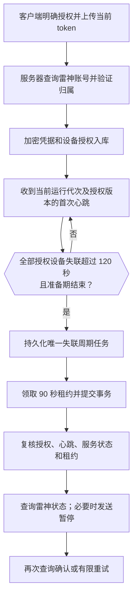

# 服务器失联保护运维与验证

适用：客户端 0.15.0、后台 0.3.0。完整分析及最终验收存于 [项目文档仓库](https://github.com/CMMUU/project-docs/tree/main/leigod-guard)。历史规划见 [REMOTE_GUARD_PLAN.md](REMOTE_GUARD_PLAN.md)。

## 授权与工作流程

平台登录/设备配对不自动开启远程保护。在客户端勾选凭据上传授权并开启后，上海服务器向雷神查询唯一账号 ID；不能验证 ID、凭据失效、或该账号归属其他平台用户时拒绝授权。仅保存 AES-256-GCM 密文，随机 96 位 nonce，关联账号摘要作为认证附加数据。管理员接口不返回 token 或密文；不收集密码/密码哈希。请求体上限 8 KiB，token 上限 4096 字节，provider 响应上限 64 KiB。

15 秒心跳；45 秒表示连接等待；120 秒为默认失联阈值；最多 600 秒准备期。按服务器接收时间计算。同账号任一授权设备新鲜心跳（游戏状态为真、假或未知均相同）都会阻止失联暂停；旧的“游戏运行中”不会永久阻止离线后的暂停。本地在线无游戏策略保持独立。

设备安装身份/心跳序号持久化；每次启动先预留新运行代次。旧代次和旧授权版本不能发送有效心跳。账号 epoch 每次有效心跳或授权变化时推进，旧排队/执行任务取消。数据库唯一 `(account_id,epoch)` 防止同一周期反复创建任务。新授权必须再次心跳才能生效。

## 任务与异常边界

- PostgreSQL 持久化队列，5 秒调度，`FOR UPDATE SKIP LOCKED` 领取任务；短事务内共享 advisory lock 串行化远程决策，事务外调用 HTTP。全局执行租约最多 2 个，同账号至多一个未过期执行租约；接口授权和后台请求共享本进程并发上限 2。
- 请求连接超时 4 秒、单次 HTTP 超时 10 秒；租约 90 秒，每次发送前要求至少剩余 15 秒。先查询：原本暂停即完成；状态未知不发暂停。发送后再次查询，超时也要查询确认；HTTP 接受不等于暂停成功。
- 一次失联最多 3 次尝试，失败后 15/45 秒退避，任务最多保留 5 分钟执行窗口。进程中断后过期租约可恢复，恢复总是先查询。重试结束记为未确认，直到新有效心跳后才可能进入新周期。
- 服务启动、调度中断超过 20 秒或公开 HTTPS 入口探测失败，都进入至少 120 秒重连观察期。探测仅证明上海能访问自身公开入口，不能证明所有用户网络正常；单节点无法区分每种网络分区。
- 至少 5 个受保护账号的最后心跳集中于 30 秒，均已失联 90 秒且占所有已武装账号的 60% 以上，暂停批量执行。此检测先于普通 120 秒暂停阈值，也识别重启后的历史集中失联。管理员在任务页确认异常后，取消旧任务、清除已武装状态；新心跳和 120 秒观察期后才能恢复。
- 雷神接口没有已验证的幂等键或服务端 fencing 保证。心跳/撤销可以取消尚未发送的请求；已经发送的请求无法撤回。查询确认发生在取消之后会记 `confirmed_after_cancel`，不能承诺外部请求 exactly-once。恢复心跳不会自动恢复雷神计时。
- 当前适配依据现有客户端的非公开 `/api/user/info`、`/api/user/pause` 协议。真实上海出口、账号 ID 字段、异地/IP 限制及 token 生命周期尚需用户实际验收；不能将模拟接口成功描述为真实雷神验证完成。

## 客户端与网页

客户端分别显示远程凭据、服务器保护状态和最近结果；仅服务器返回 `armed` 时显示保护生效。网页“远程保护”显示连接、凭据、保护、任务四类状态。平台登录有效期 30 天与雷神 token 寿命独立。

关闭保护、停止上报、退出平台、手动切换或退出雷神账号，会撤销本机保护；其他设备保持原授权。关闭意图先写入本地不含秘密的 `platform-remote-disable.pending`，同时保存在 DPAPI 设备状态；服务端确认且本地保存后清理。断网时提示未确认，并在运行中或下次启动重试；离线退出期间仍可能被服务器暂停。

网页关闭不会被后台 token 同步重新开启；失效后需用户重新授权。设备 bearer 轮换、撤销/解除绑定和用户停用都通过数据库触发器撤销远程授权。最后一台设备撤销后删除当前凭据密文，保留账号归属及历史审计。设备上的 token 更新仅在原授权仍有效且服务端验证为相同账号时刷新凭据。

## 上海部署配置

新增迁移仅 `0003_remote_pause.sql`，不修改 0001/0002。部署前必须完成数据库备份。

- `REMOTE_EXECUTION=true` 开启服务端能力；未设置时默认关闭。每台设备仍需单独主动授权。
- `/opt/leigod-guard/secrets/remote.key`：随机 32 字节，root 0600。systemd `LoadCredential=remote-key:...` 把只读凭据交给 DynamicUser；`REMOTE_KEY_FILE=%d/remote-key`。密钥不放数据库或 Git，不复用邮件密钥。
- 全局关闭：将 `REMOTE_EXECUTION=false` 后重启服务。旧授权仍保留但不执行；如果需要撤销授权，应使用设备/用户撤销路径。重新开启会重新经过观察期。
- 不能把旧 0.2.0 二进制直接切回来：SQLx 会因已应用 0003 而拒绝启动。优先关闭执行能力并向前修复；恢复包必须包含全部已应用迁移且兼容新 schema。不得删除 migration 记录或用旧备份覆盖新增用户。
- `LEIGOD_TEST_ORIGIN` 仅允许在 `PUBLIC_ORIGIN=http://127.0.0.1:<port>` 时指向回环 HTTP 根路径，生产 HTTPS 配置拒绝测试端点。
- 换密钥不能直接覆盖文件：先停止执行，使用旧密钥解密并用新密钥认证加密重新包装所有当前密文，核验后原子切换；没有旧密钥时只能删除密文并让用户重新授权。此版本不提供在线轮换管理 UI。

## 备份与恢复

每日 systemd 定时任务先做本地 PostgreSQL 自定义格式 dump，校验目录清单，本地保留 7 天。配置备份公钥后，把 dump 与应用加密密钥通过管道打包并用 age v1.3.2 加密，传输至香港 `/opt/leigod-guard-offsite`，保留 14 天。上传受限 SSH 账号仅支持固定命名的不可覆盖写入，返回 SHA-256 供发送方比对；无读取/执行任意命令权限，上传上限 128 MiB。

age 恢复私钥仅保存在维护端受限目录 `/opt/workspace/codex/env/leigod-guard-backup/recovery.agekey`；上海/HK 仅有备份公钥，服务器应用密钥包含在 age 外层加密包内以便整机恢复。仍应由维护者另行保管离线恢复私钥；丢失该私钥就无法恢复香港备份。勿把私钥与加密备份一起公开或复制到备份接收端。

恢复时：下载加密文件并核对校验；在隔离目录以恢复私钥解密；恢复到新的独立 PostgreSQL 数据库，核对 schema、用户/设备/任务数量和凭据密文，检查恢复的应用密钥字节一致。首次启动恢复服务必须 `REMOTE_EXECUTION=false`，不连接真实雷神账号；确认备份时间和失联任务后再处理授权恢复。演练不能覆盖生产数据库。

参考：[age 官方说明](https://github.com/FiloSottile/age)、[PostgreSQL SELECT 锁语义](https://www.postgresql.org/docs/18/sql-select.html)、[RustCrypto AES-GCM](https://docs.rs/aes-gcm/0.10.3/aes_gcm/)。

## 可复现验证

`cargo fmt --check`、`cargo clippy --locked --all-targets -- -D warnings`、`cargo test --locked`（在 server 目录）；Server CI 使用一次性 PostgreSQL、模拟邮件及回环 `tests/leigod_mock.py`，执行旧后台、邮箱设备和 `tests/remote_integration.py`。测试通过修改独立数据库时间制造边界，不开放生产时间加速端点。

Windows CI 验证真实 DPAPI 文件、原生 UI、静默启动/会话结束、安装/升级/卸载与自动更新；客户端 API 使用回环 HTTP 测试服务，截图仅演示数据。浏览器验证管理员/用户远程页、关闭保护交互、桌面及手机布局。最终执行结果与正式发布链接登记在项目文档仓库。
