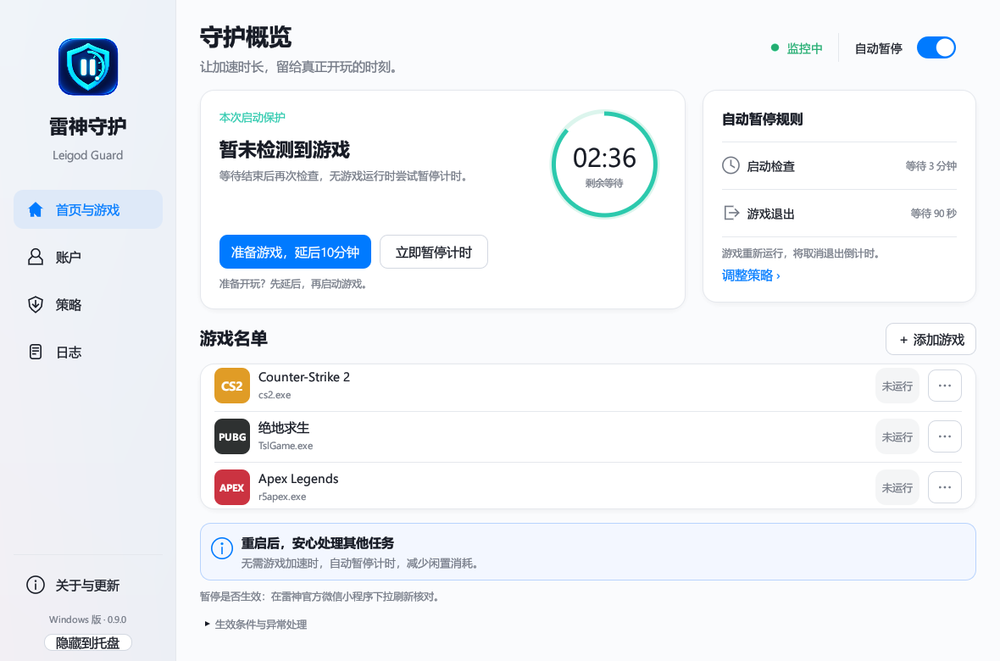

# 界面设计与验证

0.9.0 使用已确认的 Apple 浅色概念：左侧品牌导航、启动保护卡片与规则摘要、分组游戏列表、底部重启说明。程序继续使用 Rust / egui 原生界面和 Windows 窗口操作。

## 设计系统

- 主内容为近白色 `#FAFBFD`，卡片为白色；侧栏使用冷灰的轻微渐变，模拟概念图的半透明观感。无需系统级模糊或额外透明窗口。
- 文字 `#171B25`、次级文字 `#737985`、边线 `#E5E8ED`、主操作蓝色 `#007AFF`、计时圆环青绿 `#2CC9AD`。
- 页面标题 27 px、卡片标题 22 px、正文 / 控件 15 px、辅助文字 12 px；使用 Windows 系统 Segoe UI 和微软雅黑字体，不分发 Apple 字体。
- 卡片圆角 16 px、按钮 9 px、导航行 11 px；统一线性图标，避免混用彩色 emoji。保留项目原有盾牌图标。
- 游戏条目采用独立分组列表，显示名称、进程和实际观测状态。图标使用本项目绘制的文字标识，不随包分发游戏厂商图标；自定义游戏也遵循相同样式。
- 宽窗口并排显示启动保护与规则摘要；窄窗口纵向排列。侧栏随窗口缩小，内容纵向滚动，兼容 680 × 460 的最小窗口。

## 交互与真实状态

首页总开关写入原有策略；延后和立即暂停仍使用原有监控指令，视觉重排不增加自动恢复或停止加速功能。规则摘要读取实际配置值，避免把概念图中的 3 分钟 / 90 秒写死。未完成检测、进程检测失败、空名单、无效名单和自动暂停关闭均显示对应状态，不能假装正在守护或已暂停。

「添加游戏」打开表单，保留热门游戏下拉、自定义输入和进程选择；每行的更多菜单可移除该条目。账户三种登录方式、托盘行为、OSD 屏蔽和双来源更新保留。

## 验证方法

原生桌面程序不使用浏览器预览替代实现。离屏验证直接调用正式 egui 界面、渲染器和字体，以测试配置输出截图；不启动托盘或监控线程，不读取实际账号、不执行暂停。比较侧栏、文案、版式、字号、色彩、按钮、列表及窄窗口适配；指针事件测试验证首页开关、延后、手动暂停、页面导航和名单操作。

本地使用 Windows 的 `Microsoft Basic Render Driver` 软件适配器，经 DirectX 12 输出 PNG。截图是实际组件、文本和布局的渲染结果，不是把概念图片贴进窗口。CI 与发版同样执行此项检查，并上传 `native-ui-*` 截图工件。

## 与确认概念的对照

| 检查项 | 实现与核对结果 |
| --- | --- |
| 页面骨架 | 保留左侧品牌导航、右侧概览；账户、策略、日志和更新使用同一套组件。 |
| 色彩 | 近白主背景、灰蓝侧栏、白色卡片、蓝色操作与青绿倒计时，已逐项比对。 |
| 标题层次 | 页面标题 27 px；分区与弹窗标题 20 px；正文 15 px，辅助文案 12–13 px。 |
| 首页操作 | 监控状态与总开关位于右上；延后和手动暂停位于主卡片下方，真实事件测试已验证。 |
| 倒计时与规则 | 圆环位于主卡片右侧；右侧摘要读取真实配置。并排卡片底部基本对齐。 |
| 游戏列表 | 分组圆角列表保留名称、进程、状态和更多菜单。使用文字图标，覆盖自定义游戏。 |
| 重启说明 | 蓝色浅底提示和微信小程序核对说明保留；完整触发条件在下方展开。 |
| 小窗口 | 680 × 460 与 940 × 660 改为纵向卡片，可滚动；自动断言主内容不横向溢出。 |
| 高 DPI | 1180 × 780 逻辑尺寸在 150% 缩放输出 1770 × 1170 像素，文字和卡片随缩放渲染。 |

有意保留的差异：窗口边框和标题栏由 Windows 绘制；系统字体替代 Apple 字体；侧栏使用浅渐变而非系统毛玻璃；沿用原有盾牌品牌图标，游戏使用文字标识而非概念图的游戏商标。首页额外保留隐藏到托盘入口和完整规则展开项。

## 验证范围

- 真实组件的内存交互测试覆盖：总开关、准备游戏延后、手动暂停指令、导航、空账户输入校验、自定义游戏添加、更多菜单移除、GitHub / Gitee 来源切换及启动更新偏好。来源切换不发起下载。
- 进程状态测试覆盖大小写、完整进程名、无效名称、未知检测；检测失败会清除旧快照。启动检查待处理时检测失败仍可延后，完成后不重新开启。
- 截图覆盖首页、账户、策略、日志、更新和添加游戏窗口，以及小窗口与高 DPI 首页。测试状态完全独立于实际雷神账户。
- 该验证没有操作真实账户、实际游戏、关机流程或用户安装目录；软件适配器检查不等同于覆盖所有硬件显卡、OSD 与反作弊组合。

默认首页截图：



开发者可执行以下命令重新生成截图，输出位于 `target/ui-preview/`：

```powershell
cargo test --locked --target x86_64-pc-windows-msvc ui::presentation_tests::render_apple_preview -- --ignored --nocapture
```
