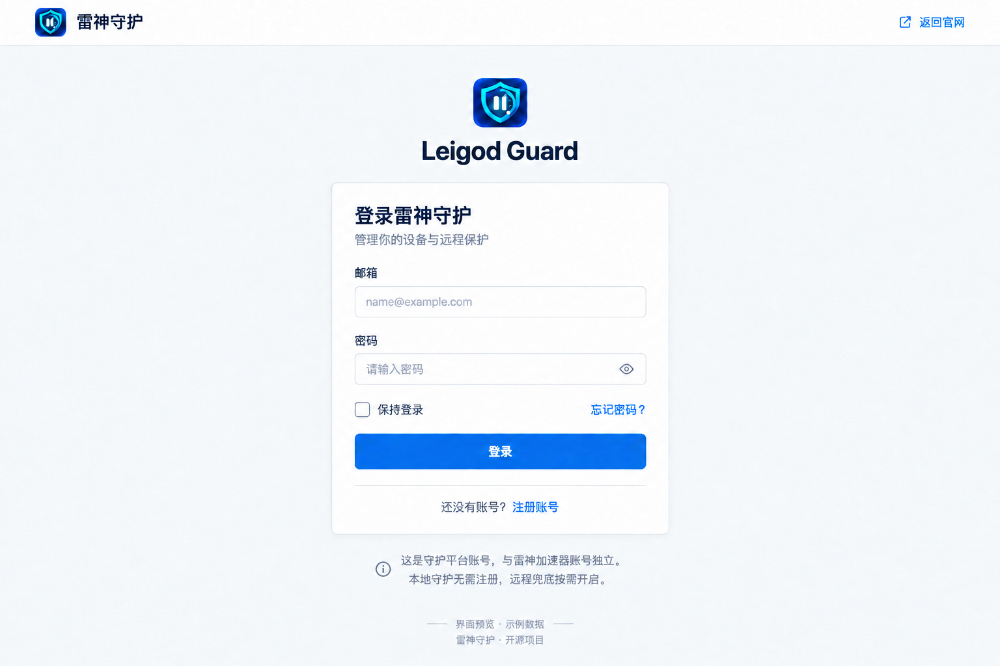
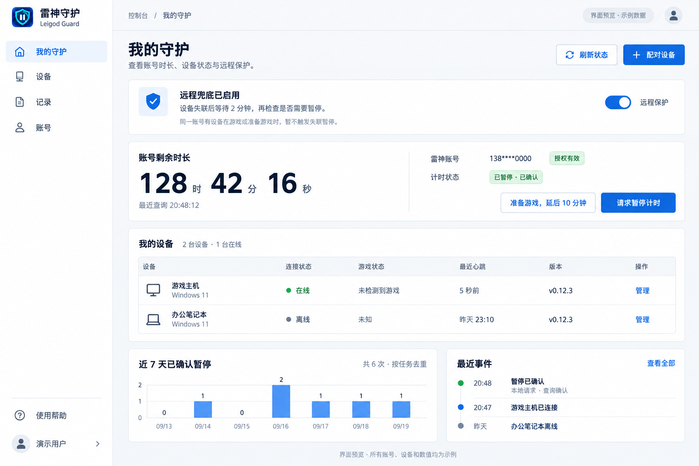
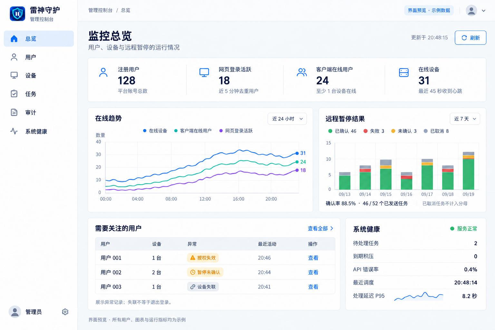

# 雷神守护远程平台 · Tabler 视觉稿

日期：2026-09-19。用户已确认 **Tabler** 为两侧共用 UI；以下为第一版视觉稿，页面设计待评审。三张图片均为内置 ImageGen 生成的静态概念图，尺寸 1536 × 1024，不是已上线功能的截图。

目前没有真实的平台注册、设备配对、服务器授权或远程暂停服务。图中的账号、用户数、版本号、图表和运行状态都是示例；客户端版本号不表示该版本已经支持远程功能。完整业务边界见 [远程守护规划](../REMOTE_GUARD_PLAN.md)，生成提示词及修正过程见 [PROMPTS.md](PROMPTS.md)。

## 01 · 登录页

- 邮箱与密码登录，提供保持登录、注册和密码找回入口。
- 明确平台账号独立于雷神加速器账号；本地守护无需注册。
- 注册及找回沿用相同布局，接入真实认证与邮件服务后才启用。管理员额外验证流程在认证实现阶段补充。

## 02 · 用户状态页

- 导航：我的守护、设备、记录、账号。
- 第一层信息：远程保护是否启用、失联等待策略与多设备保护说明。
- 第二层信息：剩余时长（时/分/秒）、查询时间、授权状态、计时状态。
- 设备使用表格，区分在线、离线、未知；离线设备的游戏状态不推断为“没有游戏”。
- 最近事件及近 7 天已确认暂停次数用于了解守护行为，不显示无法验证的节省金额。
- 配对、管理、延后、请求暂停和刷新为拟开发操作，图片按钮不能实际执行。

## 03 · 管理总览

- 导航：总览、用户、设备、任务、审计、系统健康。
- 四个统计指标分别为注册用户、网页登录活跃、客户端在线用户、在线设备；不合并为模糊的“在线人数”。
- 折线图对比三种在线口径；堆叠柱状图区分暂停已确认、失败、未确认、已取消。
- 异常用户表与系统健康区域帮助定位授权失效、暂停未确认、任务积压等情况。
- 管理页面不展示原始凭据，不提供默认批量暂停入口。真正的角色验证与用户隔离由后端负责。

## 实施用视觉规范

| 项目 | 约定 |
| --- | --- |
| 模板 | [Tabler 开源版](https://tabler.io/admin-template)，接入时固定版本并保留许可 |
| 图标 | 沿用本项目盾牌暂停标识；功能图标采用同套 Tabler 线性图标 |
| 图表 | [Apache ECharts](https://echarts.apache.org/)，随站点部署资源并保留许可 |
| 背景 / 面板 | `#f6f8fb` / `#ffffff`，不使用大面积高斯模糊 |
| 正文 / 次级文字 | `#182433` / `#667382` |
| 主色 / 边框 | `#206bc4` / `#e6e7e9` |
| 状态 | 绿色已确认；蓝色启用/操作；黄色待核实；红色失败；灰色离线/取消 |
| 圆角 / 间距 | 6–8 px；以 8 px 为间距基准，内容区约 32 px 内边距 |
| 字体 | 系统中文无衬线字体；正文以 16 px 为基准，表格数字对齐 |
| 桌面结构 | 左侧栏、顶部路径、页面标题、状态概览、表格/图表 |
| 移动端 | 侧栏收起为抽屉，摘要及图表单列，设备表保留可读列并支持横向滚动 |

图片中的颜色和间距为视觉参考，实际 CSS 以以上令牌统一，不逐个取样生成图片的细微色差。手机端尚未制作视觉稿，也没有进行浏览器实现或响应式测试。

## 状态与交互要求

1. 未开通远程功能、未绑定账号、设备为空、请求中、查询超时、授权失效、凭据撤销均需独立状态；不以绿色演示值填充。
2. 查询失败保留最近一次值并标注过期及查询时间，不能当作实时剩余时长。轮询间隔先按 10–15 秒；秒级显示若本地估算需标明依据并定期校准。
3. “请求已接受”“接口返回成功”“查询确认暂停”分层反馈；没有确认时保持未确认。暂停计时不表示已经停止加速。
4. 用户明确开启远程兜底时说明所需授权、覆盖设备与失联阈值；关闭或撤销后取消尚未发出的任务。
5. 已进入游戏、准备游戏保护、多台电脑同时使用和请求执行前重新核对，遵循远程规划；不能仅因某台设备离线就暂停整个账号。
6. 页面预览标识必须在设计展示中保留；接入真实服务后移除示例数据，不保留假登录或假统计。

## 示例图表口径

这些数据只用于视觉校验，不是当前用户或网站真实统计。

- 用户状态图：7 天暂停次数 `0, 1, 0, 2, 1, 1, 1`，合计 6 次。
- 管理总览：注册 128 人，近 5 分钟网页登录活跃 18 人，客户端在线 24 人，在线设备 31 台。
- 管理任务图：每列为 09/13–09/19，按唯一任务计数，重试不额外增加任务数。

| 结果 | 09/13 | 09/14 | 09/15 | 09/16 | 09/17 | 09/18 | 09/19 | 合计 |
| --- | ---: | ---: | ---: | ---: | ---: | ---: | ---: | ---: |
| 已确认 | 5 | 6 | 7 | 4 | 8 | 6 | 10 | 46 |
| 失败 | 0 | 1 | 0 | 1 | 0 | 1 | 0 | 3 |
| 未确认 | 0 | 0 | 1 | 0 | 1 | 0 | 1 | 3 |
| 已取消 | 1 | 1 | 2 | 1 | 1 | 1 | 1 | 8 |

已发送任务共 52 个，确认率 `46 / 52 = 88.5%`（保留一位小数）；8 个发送前取消的任务不进入分母。健康指标及延迟曲线同样为示例；真实统计需标注采样窗口。

## 本次检查

已查看三张最终图片，检查品牌一致性、导航与布局、中文文字、浅色背景、状态区分、时长秒数、示例标识及图表主要数值。修正了登录稿背景与页脚文字，并调整管理柱状图尺度，使其与合计数字一致。

这次交付只包含设计资料，不改动桌面程序、关机处理、现有官网或服务器配置。下一阶段按已约定顺序评审视觉稿、检查服务器和雷神接口，再实施认证与远程守护。
