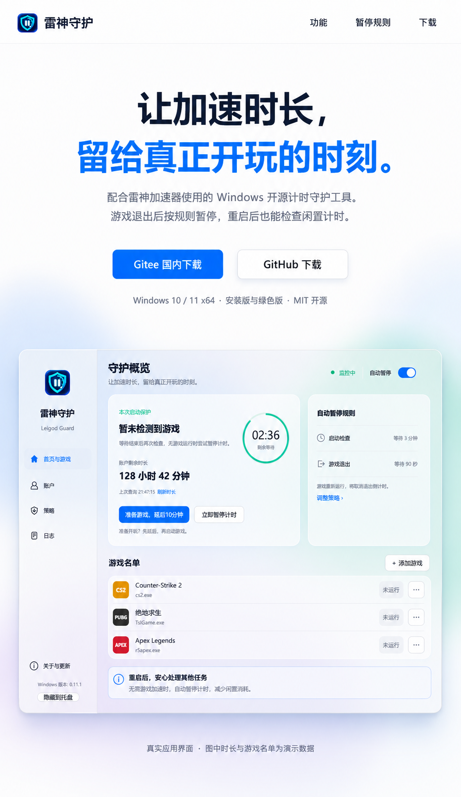
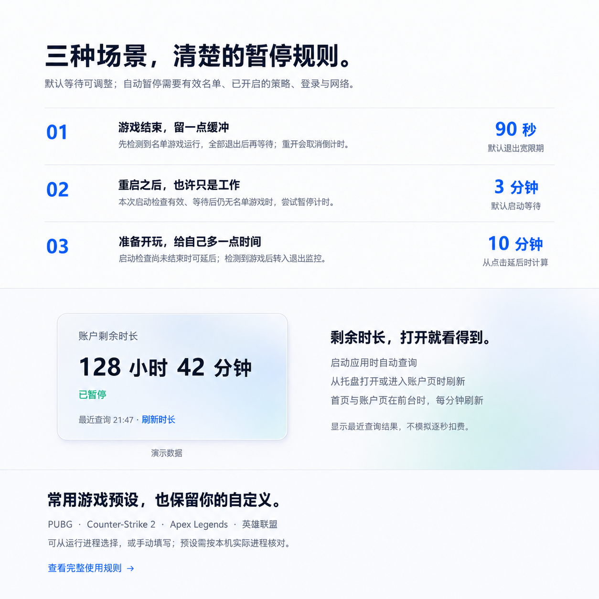
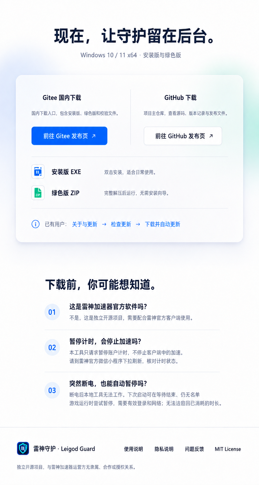

# 雷神守护项目网站 · 第一版设计稿

状态：**设计已确认，单页已在 `website/` 实现。** 部署配置与维护方式见 [网站维护说明](../../website/README.md)。

本次范围：调整仓库 README 文案，设计一个与当前 Windows 应用视觉一致的单页项目网站。用户确认本设计后再开发页面，页面源码与本仓库一起维护和提交。本站属于雷神守护独立开源项目，不是雷神加速器运营方的官方网站。

## 三张连续页面效果图

以下是同一单页从上到下的三个连续区域，不是三个独立页面。

1. [首屏与应用预览](01-hero-v1.png)：现有图标、项目定位、双下载入口、原生应用演示截图。
2. [暂停规则与功能](02-features-v1.png)：三个独立使用场景、剩余时长刷新、常用游戏预设。
3. [下载、常见问题与页脚](03-download-v1.png)：下载来源、两种发行方式、使用边界和文档入口。

## 页面内容与交互约定

| 位置 | 内容与行为 |
| --- | --- |
| 顶部导航 | 现有盾牌图标与“雷神守护”；“功能”“暂停规则”“下载”定位到本页对应区域。 |
| 主标题 | “让加速时长，留给真正开玩的时刻。” |
| 主说明 | “配合雷神加速器使用的 Windows 开源计时守护工具。游戏退出后按规则暂停，重启后也能检查闲置计时。” |
| 首屏下载 | “Gitee 国内下载”为主要按钮，“GitHub 下载”为备用入口；分别进入下表对应的公开发布页。 |
| 应用截图 | 复用仓库 `assets/ui-home.png`，标注为演示数据；最终网页使用真实截图，不以生成图替代原生界面。 |
| 游戏退出规则 | 先观察到名单游戏运行，再检测到全部退出；默认等待 90 秒，复查后尝试暂停。游戏重新运行会取消该次倒计时。 |
| 启动规则 | 仅在本次启动检查有效时，默认连续等待 3 分钟，复查仍无名单游戏才尝试暂停。不是断电后仍能远程工作。 |
| 准备游戏 | 只延后尚未结束的启动检查，保护到至少点击后 10 分钟；不是重新启动已结束的检查，也不是逐次累加。 |
| 剩余时长 | 128 小时 42 分钟为演示值，网页不查询或展示访客账号；说明应用启动、从托盘打开、进入账户页时刷新，前台首页/账户页每分钟刷新。 |
| 游戏举例 | PUBG、Counter-Strike 2、Apex Legends、英雄联盟；说明需要核对实际进程，不声称逐款验证兼容性。 |
| 下载说明 | 安装版 EXE：双击安装；绿色版 ZIP：完整解压后运行。两种均是 Windows x64。网站不托管另一套安装包。 |
| 常见问题 | 以展开的问答行呈现独立项目定位、暂停计时与停止加速的区别、断电后的能力边界。 |
| 页脚 | 使用说明、隐私说明、问题反馈、MIT License；注明与雷神加速器运营方无隶属、合作或授权关系。 |

### 下载与文档目标

| 入口 | 地址 |
| --- | --- |
| Gitee 发布页 | https://gitee.com/cmmuu/leigod-guard/releases |
| GitHub 最新正式版 | https://github.com/CMMUU/leigod-guard/releases/latest |
| 使用说明 | https://gitee.com/cmmuu/leigod-guard/blob/main/README.md |
| 隐私说明 | https://gitee.com/cmmuu/leigod-guard/blob/main/docs/PRIVACY.md |
| 问题反馈 | https://github.com/CMMUU/leigod-guard/issues |
| 开源许可 | https://gitee.com/cmmuu/leigod-guard/blob/main/LICENSE |

下载按钮跳转到发布页，由用户选择安装版或绿色版。图中的“关于与更新 → 检查更新 → 下载并自动更新”是应用内操作说明，不应制作成网页中的虚假更新按钮。网站不接受账户登录，不运行暂停请求，也不承诺两个平台永远同步到同一版本。

### 常见问题的正文

- **这是雷神加速器官方软件吗？** 不是。这是独立开源项目，需要配合雷神官方客户端使用。
- **暂停计时，会停止加速吗？** 本工具只请求暂停账户计时，不停止客户端中的加速。请到雷神官方微信小程序下拉刷新，核对计时状态。
- **突然断电，也能自动暂停吗？** 断电后本地工具无法工作。下次启动可在等待结束、仍无名单游戏运行时尝试暂停，需要有效登录和网络；无法追回已消耗的时长。

图像生成中的字形细节不代替上述产品规则。最终网页须使用可选择、可搜索的真实文字，保持“名单游戏”“本次启动检查有效”“尝试暂停”等条件，不从效果图识别文字后直接照抄。

## 视觉方向

- 基础背景为白色，应用展示与下载区使用浅蓝、薄荷绿和少量淡紫色的柔和背景；蓝色为主要操作色，深蓝色为正文。
- 现有应用图标保持不变；Gitee/GitHub 下载区采用纯文字标题，不把应用盾牌当成下载平台标识。
- 玻璃面板保留清晰边界、轻阴影和充足文字对比度；只在应用预览、余额示例和下载区域使用，不把每段内容都包进卡片。
- 暂停规则使用三条独立横向内容行，不绘制暗示三者依次执行的连续时间轴。
- 首屏居中，规则左对齐，余额区左右布局，下载区双列，FAQ 使用展开的文字行，形成连续而有变化的阅读顺序。
- 移动端延续同一视觉：导航精简，双按钮与双列区域纵向排列，规则的时长数字移到标题下方，正文不横向溢出；应用截图可以缩放，旁边的说明须能独立读懂。
- 网页交互只包含页内导航、外部链接和必要的轻量视觉反馈；动效服从减少动态效果的系统设置。

## 确认后的开发边界

单页在仓库的 `website/` 目录维护，使用真实 HTML/CSS 和仓库已有的应用图标、演示截图。构建时生成静态页面、带内容指纹的资源、搜索引擎索引文件和响应头配置。Cloudflare Pages 从本仓库构建，网站源码随仓库同步。

原生应用截图保留 1180 × 780 的真实比例；效果图中的截图区域存在纵向拉伸，网页不复现这处失真。移动端按内容重新排版，仍保留所有说明与两个下载来源。

如需展示具体版本号，后续应与仓库发布信息维护在同一流程，不能长期硬编码过期版本。页面的说明以当前 README、配置与源码为准，不写远程服务器守护、macOS 支持、收益数字或其他尚未实现的功能。

本设计使用内置 ImageGen 生成，提示词保存在 [PROMPTS.md](PROMPTS.md)。输入是本项目图标与包含演示数据的原生截图；没有使用真实账户信息、密码、token 或私有用户数据。
